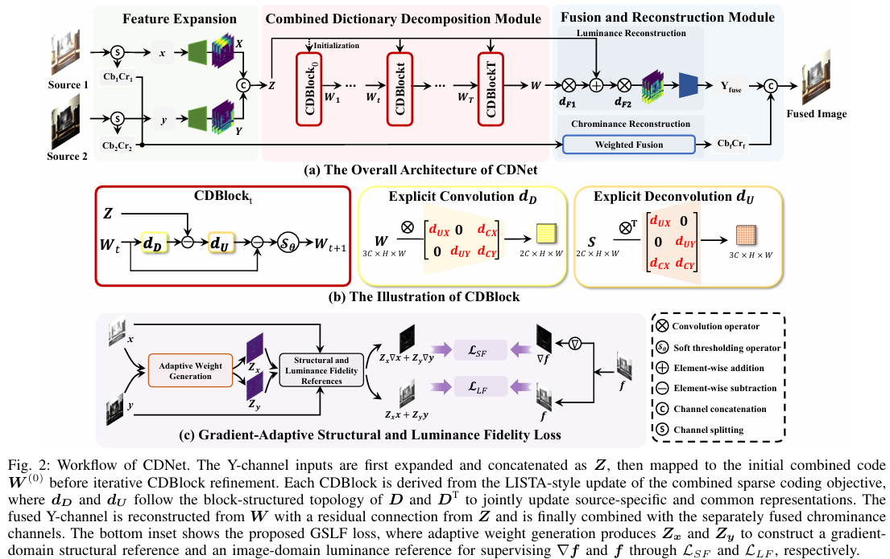
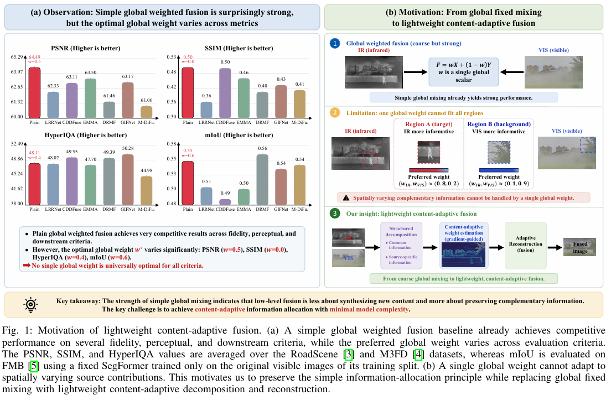

# CDNet Dual-Source Image Fusion

CDNet is a batch image fusion project for dual-source inputs. The current version keeps a direct two-source inference workflow: it reads paired images from `input/SourceA` and `input/SourceB`, loads CDNet weights from `model/latest.pth`, and saves fused images to `output`.

## Usage

Run the following command from the project root:

```bash
python infer.py --input input --output output
```

Optional GPU inference:

```bash
python infer.py --input input --output output --device cuda
```

For large images, adjust the tile size:

```bash
python infer.py --input input --output output --tile-size 512
```

## Dataset

The dataset can be downloaded from the following drives. The links below are placeholders and should be replaced with the actual share links before release.

| Source | Link |
| --- | --- |
| Google Drive | [https://drive.google.com/file/d/1Hc5OzWD1-7qKylZN-9UajkXgS0tu9NOL/view?usp=drive_link](https://drive.google.com/file/d/1Hc5OzWD1-7qKylZN-9UajkXgS0tu9NOL/view?usp=drive_link) |
| Quark Drive | [https://pan.quark.cn/s/58593be7114c](https://pan.quark.cn/s/58593be7114c) |

After downloading, organize the images into two input sources:

```text
input
├─ SourceA
│  ├─ <name_1>.<ext>
│  ├─ <name_2>.<ext>
│  └─ ...
└─ SourceB
   ├─ <name_1>.<ext>
   ├─ <name_2>.<ext>
   └─ ...
```

Images in `SourceA` and `SourceB` are paired by file stem. For example, `<name_1>.jpg` and `<name_1>.png` are treated as one input pair. Supported extensions are `.jpg`, `.jpeg`, `.png`, `.bmp`, `.tif`, and `.tiff`.

## Environment Versions

```text
Python          3.10.20
PyTorch         2.10.0+cu130
TorchVision     0.25.0+cu130
CUDA Toolkit    13.0.2
OpenCV Python   5.0.0.93
NumPy           2.2.6
Pillow          12.3.0
scikit-image    0.25.2
SciPy           1.15.3
Matplotlib      3.10.9
einops          0.8.2
kornia          0.8.2
timm            1.0.28
```

## Project Structure

```text
CDNet
├─ CDNet.py
├─ infer.py
├─ model
│  └─ latest.pth
├─ input
│  ├─ SourceA
│  └─ SourceB
├─ output
├─ movitation.png
├─ workflow.png
└─ Random-Training-Images-Generation
```

| Path | Description |
| --- | --- |
| `CDNet.py` | Main CDNet model definition, including `Decompose`, `Fuse`, and `CDNet`. |
| `infer.py` | Inference entry point for batch dual-source image fusion. |
| `model/latest.pth` | Default model weight file. |
| `input/SourceA` | First source image directory. |
| `input/SourceB` | Second source image directory. |
| `output` | Directory for fused output images. |
| `movitation.png` | Motivation figure. |
| `workflow.png` | CDNet workflow figure. |
| `Random-Training-Images-Generation` | Auxiliary directory for random training image generation, used to build random noise and complementary source images. |

## Input and Output

Input requirements:

- `input/SourceA` and `input/SourceB` must both exist.
- Images are paired automatically by matching file stem.
- If the two source images have different sizes, `SourceB` is resized to match `SourceA`.
- Files that cannot be paired across the two source directories are skipped, and a warning is printed in the terminal.

Output rule:

```text
input/SourceA/<name>.* + input/SourceB/<name>.* -> output/<name>.png
```

The default output suffix is `.png`. It can be changed with `--output-suffix`.

## Workflow

`workflow.png` shows the overall CDNet pipeline.



The current inference workflow is:

```text
SourceA / SourceB
-> BGR loading
-> YCbCr conversion
-> CDNet fusion on the Y channel
-> Weighted fusion for Cb/Cr channels
-> Save fused BGR image
```

Main modules in `CDNet.py`:

- `Decompose`: a combined dictionary decomposition module that iteratively updates decomposition representations through stacked CDBlocks.
- `Fuse`: a lightweight fusion module that combines decomposed and joint representations with 1x1 convolutions.
- `CDNet`: the complete dual-input fusion model.

## Motivation

`movitation.png` illustrates the motivation of the method: simple global weighted fusion can be a strong baseline, but fixed weights cannot adapt to spatially varying content or source-specific contributions. CDNet uses a lightweight, content-adaptive fusion strategy.



## Arguments

| Argument | Default | Description |
| --- | --- | --- |
| `--input` | `input` | Input root directory containing `SourceA` and `SourceB`. |
| `--output` | `output` | Output directory for fused images. |
| `--weights` | `model/latest.pth` | Path to the CDNet weight file. |
| `--source-a` | `SourceA` | Folder name of the first source under `--input`. |
| `--source-b` | `SourceB` | Folder name of the second source under `--input`. |
| `--output-suffix` | `.png` | Output image suffix. |
| `--device` | `cpu` | Inference device, either `cpu` or `cuda`. |
| `--tile-size` | `512` | Tile size for memory-friendly inference on large images. |
